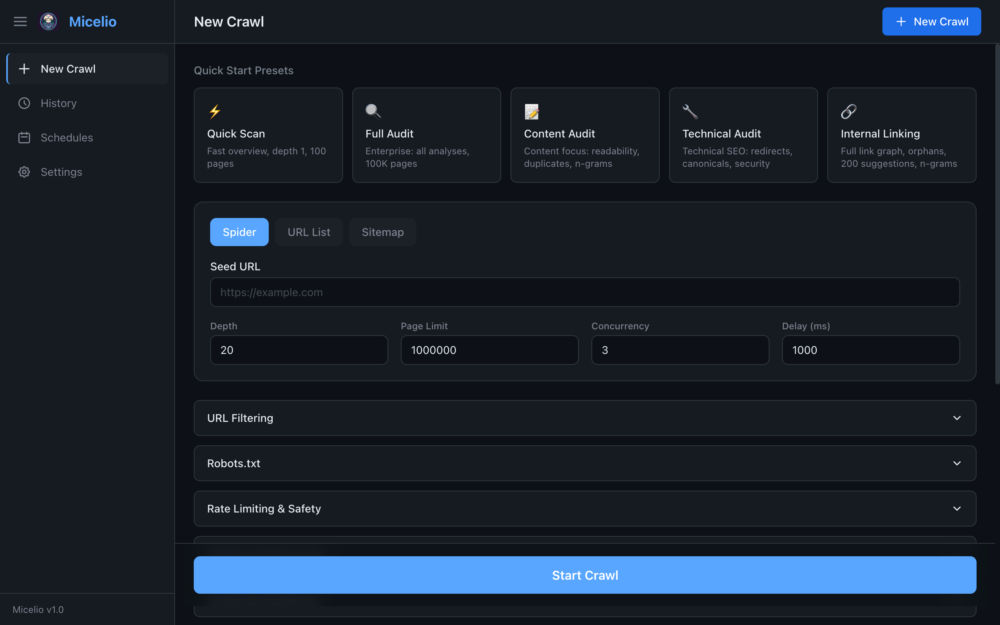
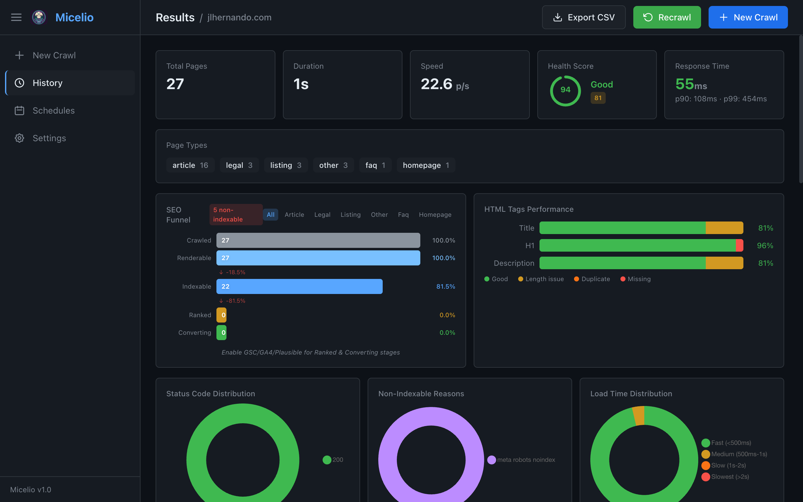
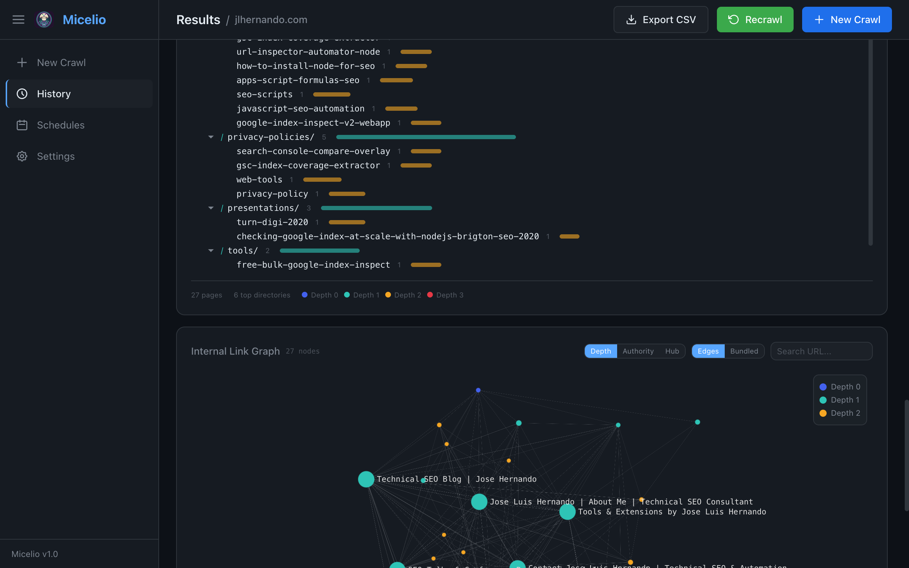
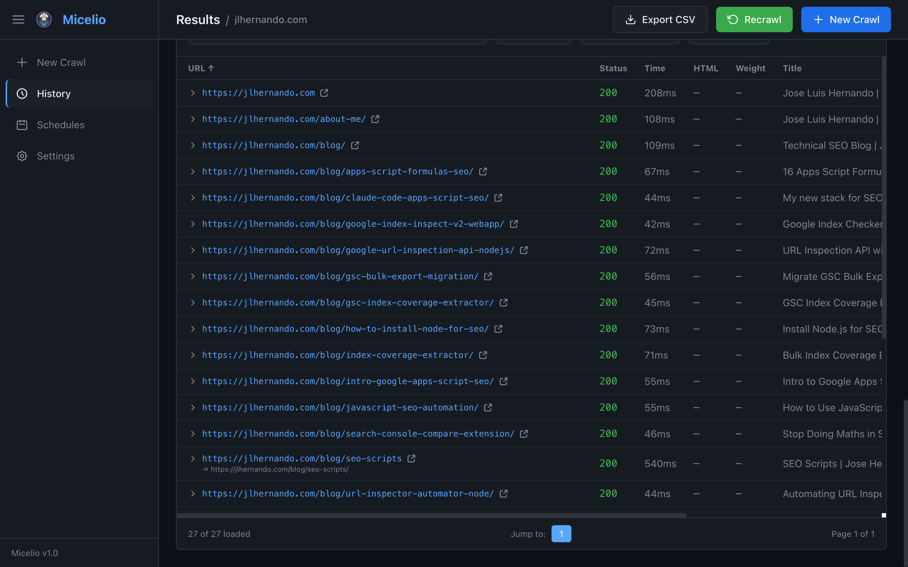

<p align="center">
  
</p>

<h1 align="center">Micelio</h1>

<p align="center">Enterprise-grade SEO crawler built in Go. Single-binary CLI and web dashboard for technical SEO audits, content analysis, and internal link intelligence.</p>

<p align="center">
  <a href="https://github.com/jlhernando/micelio-crawler/releases/latest"></a>
  <a href="LICENSE"></a>
</p>

## Quick Start

### Download a binary (recommended)

Grab the latest release for your platform from the [releases page](https://github.com/jlhernando/micelio-crawler/releases/latest) — no build tools needed. Binaries are available for Linux (amd64/arm64), macOS (Intel/Apple Silicon), and Windows (amd64/arm64).

```bash
# macOS (Apple Silicon) example
curl -LO https://github.com/jlhernando/micelio-crawler/releases/latest/download/micelio-darwin-arm64
chmod +x micelio-darwin-arm64
mv micelio-darwin-arm64 /usr/local/bin/micelio
```

> **Note (macOS):** binaries are unsigned. If Gatekeeper blocks the first run, clear the quarantine flag: `xattr -d com.apple.quarantine /usr/local/bin/micelio`.

Verify a download against the release's `checksums.txt`:

```bash
curl -LO https://github.com/jlhernando/micelio-crawler/releases/latest/download/checksums.txt
shasum -a 256 -c checksums.txt --ignore-missing
```

Once installed, the in-app updater keeps the binary current: it polls GitHub releases and verifies SHA256 checksums before applying an update.

### Install from source

```bash
# Clone and build (includes dashboard)
git clone https://github.com/jlhernando/micelio-crawler.git
cd micelio-crawler
make build-with-dashboard

# Or install directly to $GOPATH/bin
make install
```

### Run

```bash
# Crawl a site
micelio crawl https://example.com

# Launch web dashboard
micelio ui --port 3100
# Open http://localhost:3100
```

### Prerequisites

- **Go 1.26+** for building
- **Node.js 20+** and **npm** for building the dashboard
- **Chrome/Chromium** (optional) for JS rendering (`--js` flag)

## Web Dashboard

The Svelte 5 dashboard is embedded in the Go binary via `go:embed`. No separate server needed.

<p align="center">
  <br>
  <br>
  <br>
  
</p>

### Dashboard Pages

| Page | Description |
|------|-------------|
| **New Crawl** | Configure and start crawls with 5 presets and 10+ config sections. User-agent dropdown with Chrome DevTools-inspired presets (Desktop, Mobile, Bots). Recent sites quick-start. |
| **Monitor** | Real-time progress via WebSocket — status codes, response times, error log, pause/resume/cancel, stop & analyze, per-pattern excluded URL counters |
| **Results** | 7 tabs: Issues, Performance, Content, Links, Signals, AI Visibility, All Pages. Link Explorer (progressive drill-down graph) + Full Graph (WebGL), directory tree, anchor cloud. Template-based filtering with filtered stats and CSV export. |
| **History** | Crawl history with side-by-side diff comparison, active crawls sidebar, status filters |
| **Diff** | Side-by-side comparison with visibility, segments, lifecycle tracking, topic evolution, and cannibalization detection |
| **Logs** | Server log analysis — parallel multi-file processing with per-file aggregation, 6 formats (Apache, Nginx, CloudFront, Cloudflare, ALB/ELB, W3C/IIS), zero-alloc bot detection (100+ signatures), crawl budget/waste analysis, AI bot trends, heatmaps, log-to-crawl merge with 7-segment classification, per-phase timing |
| **Schedules** | Manage cron-scheduled crawls and view run history |
| **Settings** | Persistent settings (SQLite) — API keys, defaults, 6 config sections |

## CLI Commands

| Command | Description |
|---------|-------------|
| `crawl <url>` | Spider crawl with full SEO analysis |
| `list <file>` | Crawl URLs from a text file (one URL per line) |
| `sitemap <url...>` | Crawl all URLs from XML sitemaps |
| `head <file>` | HEAD-only crawl for status codes and headers |
| `robots-test <url>` | Test robots.txt rules for 21 bot signatures |
| `verify-bot <ip>` | Verify if IPs belong to known Google crawlers |
| `diff <old.jsonl> <new.jsonl>` | Compare two crawl outputs side by side |
| `generate-sitemap <file>` | Generate XML sitemap from JSONL crawl output |
| `schedule <url>` | Run crawls on a cron schedule with webhook notifications |
| `schedules` | List all scheduled crawls and their status |
| `logs <file1> [file2...]` | Analyze server access log files (multi-file, parallel, auto-detect format) |
| `gsc-auth` | OAuth2 flow for Google Search Console authentication |
| `build` | Rebuild and install micelio from source (`--skip-dashboard` for Go-only) |
| `ui` | Launch the web dashboard |

### crawl

The main command. Spider-crawls a website with full SEO analysis.

```bash
micelio crawl <url> [flags]
```

**Core flags:**
| Flag | Default | Description |
|------|---------|-------------|
| `-d, --depth` | 10 | Maximum crawl depth |
| `--max-pages` | 1000 | Maximum pages to crawl |
| `-c, --concurrency` | 5 | Concurrent requests |
| `--delay` | 200 | Delay between requests (ms) |
| `-u, --user-agent` | Micelio/1.0 | User-Agent string |
| `-o, --output` | stdout | Output file path |
| `-f, --format` | jsonl | Output format (`jsonl` or `csv`) |
| `--no-robots` | false | Ignore robots.txt restrictions |
| `--allowed-domains` | | Additional domains to crawl |
| `--include` | | Include URL patterns (regex) |
| `--exclude` | | Exclude URL patterns (regex) |
| `--proxy` | | HTTP proxy URL |
| `--cookies` | | Cookie string |
| `-H, --header` | | Custom headers (`Name: Value`) |
| `--max-errors` | 0 | Stop after N errors (0 = unlimited) |
| `--timeout` | 0 | Stop after N seconds (0 = unlimited) |
| `--memlimit` | | Soft memory limit (e.g. `2GiB`, `512MiB`) |
| `--db` | | SQLite path for crawl persistence |
| `--no-db` | false | Disable automatic crawl database creation |
| `--resume` | false | Resume interrupted crawl (requires `--db`) |
| `--adaptive-rate` | false | Dynamically adjust request rate based on server feedback |
| `--stealth` | false | Mimic Chrome TLS/HTTP fingerprint to evade bot detection |
| `--tor-control-port` | | Tor control port address for IP rotation (e.g. `127.0.0.1:9051`) |
| `--tor-password` | | Tor control port password |
| `--tor-rotate` | 0 | Rotate Tor circuit every N requests (default 50) |

**Analysis flags:**
| Flag | Description |
|------|-------------|
| `--js` | Enable JS rendering with headless Chrome |
| `--render-block-resources` | Block images/fonts/analytics during JS rendering (default: true) |
| `--render-timeout` | JS render timeout in seconds (default: 30) |
| `--check-external` | Check external links for broken URLs |
| `--link-intelligence` | Internal link graph analysis (centrality, orphans, suggestions) |
| `--li-no-centrality` | Skip centrality computation (faster for large sites) |
| `--li-max-suggestions` | Max internal link suggestions (default 20) |
| `--show-blocked-internal` | Include robots-blocked internal URLs in output |
| `--ngrams` | N-gram frequency analysis (multilingual) |
| `--language` | Language for n-gram stopword filtering (default: `en`) |
| `--embeddings` | Semantic similarity via embeddings |
| `--embedding-provider` | Embedding provider (`openai` or `ollama`, default: `openai`) |
| `--embedding-model` | Embedding model name |
| `--embedding-key` | Embedding API key |
| `--similarity-threshold` | Similarity threshold for embeddings (default: 0.9) |
| `--page-weight` | Analyze page weight (HEAD requests for resource sizes) |
| `--full-page-weight` | Include per-resource detail (default: aggregate only) |
| `--sitemap-out` | Generate XML sitemap from crawled indexable pages |
| `--html` | Generate self-contained HTML report |
| `--html-open` | Auto-open HTML report in browser |
| `--full-anchors` | Include full anchor data in output |

**Integration flags:**
| Flag | Description |
|------|-------------|
| `--psi` | PageSpeed Insights per-page analysis |
| `--psi-key` | PSI API key |
| `--crux` | Chrome UX Report data enrichment |
| `--crux-key` | CrUX API key |
| `--crux-form-factor` | CrUX form factor (`PHONE`, `DESKTOP`, `ALL`) |
| `--gsc` | Google Search Console data |
| `--gsc-property` | GSC property URL |
| `--gsc-key-file` | Path to service account JSON |
| `--gsc-days` | GSC data lookback days (default: 90) |
| `--gsc-bq` | Use BigQuery bulk export (`project.dataset` format) |
| `--ga4` | Google Analytics 4 data |
| `--ga4-property` | GA4 property ID |
| `--ga4-key-file` | Path to service account JSON |
| `--ga4-days` | GA4 data lookback days (default: 90) |
| `--plausible` | Plausible Analytics data |
| `--plausible-site-id` | Plausible site ID |
| `--plausible-api-key` | Plausible API key |
| `--plausible-days` | Plausible data lookback days (default: 30) |
| `--plausible-host` | Custom Plausible host URL |
| `--ai-prompt` | AI per-page analysis prompt |
| `--ai-provider` | AI provider (`openai`, `anthropic`, `ollama`) |
| `--ai-model` | AI model name |
| `--ai-key` | AI API key |

**Custom extraction flags:**
| Flag | Description |
|------|-------------|
| `--extract` | CSS extraction (`name:selector`) |
| `--search` | Text or `/regex/` search in page source |
| `--snippet` | JS snippet file to run in headless Chrome (requires `--js`) |
| `--segment` | URL segment rule (`name:pattern`) |

### Examples

```bash
# Quick scan (depth 1, 100 pages)
micelio crawl https://example.com -d 1 --max-pages 100

# Full audit with all analysis
micelio crawl https://example.com --link-intelligence --ngrams --page-weight --check-external --html

# JS rendering with Chrome user-agent
micelio crawl https://example.com --js --max-pages 200 \
  -u "Mozilla/5.0 (Macintosh; Intel Mac OS X 10_15_7) AppleWebKit/537.36 (KHTML, like Gecko) Chrome/131.0.0.0 Safari/537.36"

# Crawl with custom extraction
micelio crawl https://example.com \
  --extract "author:.author-name" \
  --search "out of stock" \
  --search "/price:\s*\$[\d,]+/"

# JS snippets (requires --js)
micelio crawl https://example.com --js \
  --snippet snippets/heading.js \
  --snippet snippets/audit-checks.js

# Multi-domain crawl
micelio crawl https://example.com --allowed-domains example.com,blog.example.com

# Resume interrupted crawl
micelio crawl https://example.com --db crawl.db
# If interrupted, resume with:
micelio crawl https://example.com --db crawl.db --resume

# Crawl with timeout and error limits
micelio crawl https://example.com --timeout 300 --max-errors 50

# Crawl with integrations
micelio crawl https://example.com --gsc --gsc-property "https://example.com/" --gsc-key-file sa.json

# Output as CSV
micelio crawl https://example.com -f csv -o crawl.csv
```

### list

Crawl a predefined list of URLs (one per line).

```bash
micelio list urls.txt -c 10 --delay 100 -o results.jsonl
```

### sitemap

Crawl all URLs found in XML sitemaps. Supports standard, news, video, and image extensions. Follows nested `<sitemapindex>` files and gzip-compressed sitemaps, and works when the sitemap is hosted on a different domain or CDN than the pages it lists (e.g. an S3-hosted sitemap). Crawls exactly the listed URLs — it does not spider out via on-page links.

```bash
micelio sitemap https://example.com/sitemap.xml
micelio sitemap https://example.com/sitemap.xml https://example.com/sitemap-news.xml -l 5000
# Sitemap hosted on a CDN, pages on the main domain:
micelio sitemap https://cdn.example.com/sitemaps/sitemap.xml
```

### head

Lightweight HEAD-only crawl. Returns status codes, redirect chains, and response headers without downloading page bodies.

```bash
micelio head urls.txt -c 20 -o status-check.jsonl
micelio head urls.txt --csv -o status.csv
```

### robots-test

Test robots.txt rules against 21 bot signatures including Googlebot, Google-Agent, Google-Extended, Bingbot, GPTBot, and more.

```bash
micelio robots-test https://example.com
micelio robots-test https://example.com --json
micelio robots-test https://example.com --agents "Googlebot,Bingbot,GPTBot" --url "/private,/api"
```

### verify-bot

Verify if IP addresses belong to known Google crawlers. Checks against Google's official IP range JSON files (Googlebot, special crawlers, user-triggered fetchers including Google-Agent). IP ranges are cached locally for 24 hours.

```bash
micelio verify-bot 66.249.79.1
micelio verify-bot 66.249.79.1 192.168.1.1 --json
```

### diff

Compare two JSONL crawl files to find added, removed, and changed pages.

```bash
micelio diff old-crawl.jsonl new-crawl.jsonl
micelio diff old.jsonl new.jsonl --html diff-report.html
micelio diff old.jsonl new.jsonl --json report.json --full
```

### generate-sitemap

Generate an XML sitemap from a JSONL crawl output (only includes indexable 200-status pages).

```bash
micelio generate-sitemap crawl-output.jsonl -o sitemap.xml
micelio generate-sitemap crawl.jsonl --changefreq weekly --priority 0.8
```

### schedule

Run automated crawls on a cron schedule with persistent state and optional webhook notifications.

```bash
# Daily crawl at 2 AM
micelio schedule https://example.com --cron "0 2 * * *" --link-intelligence --ngrams

# Weekly crawl with webhook
micelio schedule https://example.com --cron "@weekly" --webhook https://hooks.slack.com/...

# Limited runs
micelio schedule https://example.com --cron "@daily" --max-runs 7
```

### schedules

List all active scheduled crawls and their status.

```bash
micelio schedules
```

### ui

Launch the web dashboard.

```bash
micelio ui                          # Default port 3100
micelio ui --port 8080              # Custom port
micelio ui --host 0.0.0.0          # Bind to all interfaces
micelio ui --auth-token SECRET     # Require Bearer token for API (or MICELIO_AUTH_TOKEN env)
```

## Custom Snippets

Run arbitrary JavaScript on each page using headless Chrome. Requires the `--js` flag.

```bash
micelio crawl https://example.com --js --snippet ./my-snippet.js
```

Snippet files contain **raw JavaScript expressions** (not ES modules). The return value is stored in crawl results under `snippetResults` keyed by filename.

```javascript
// snippets/heading.js
document.querySelector('h1')?.textContent
```

```javascript
// snippets/hero-data.js
({
  heading: document.querySelector('h1')?.textContent,
  heroImage: document.querySelector('.hero img')?.src,
  articleDate: document.querySelector('time')?.getAttribute('datetime'),
  wordCount: document.body.innerText.split(/\s+/).length
})
```

```javascript
// snippets/audit-checks.js
({
  hasLazyImages: document.querySelectorAll('img[loading="lazy"]').length,
  hasCookieBanner: !!document.querySelector('[class*="cookie"], [id*="cookie"]'),
  externalScripts: [...document.querySelectorAll('script[src]')]
    .filter(s => !s.src.includes(location.hostname))
    .map(s => s.src)
})
```

## Features

### Crawl Controls
- Pause, resume, and cancel crawls from the dashboard
- Stop & analyze: graceful stop with full post-crawl analysis (link intelligence, signals, report)
- Resume crawl after app restart with editable settings
- Active crawls sidebar with quick switching between concurrent crawls

### Server Log Analysis
- Multi-file upload with streaming progress (drag-and-drop or file browser)
- Auto-detection of 8 log formats: Apache Combined/CLF, Nginx, AWS CloudFront (TSV/CSV), Cloudflare (JSON), ALB/ELB, W3C/IIS
- Bot detection with 100+ signatures across categories (search, AI training, AI search, social, SEO tools, monitoring)
- Zero-allocation case-insensitive bot matching (no `strings.ToLower()` per line)
- Crawl budget analysis: waste detection, redirect chains, error rate tracking
- AI bot trend tracking: emergence of AI training and AI search bots over time
- Heatmaps: 7-day x 24-hour bot activity matrix
- Log-to-crawl merge with 7-segment classification (healthy, crawled-not-indexed, uncrawled-indexable, orphan-crawled, crawl-waste, redirect-waste, error-pages)
- Anomaly detection using z-score analysis for traffic spikes
- Bot IP verification against known crawler IP ranges
- Per-URL bot/human hit breakdown with status filtering
- Per-phase timing: upload, parse, and analysis durations tracked and displayed
- **High-performance pipeline** (tested with 3 × 6.5GB files, 28M lines in 2.5 min — 303K lines/s):
  - GC suppression during parsing (`debug.SetGCPercent(-1)`) — eliminates 58% GC overhead
  - Zero-I/O parsing: all stats in memory, single sorted bulk INSERT after parse
  - Per-job URL tables: instant deletion via DROP TABLE (was 8-10 min for 12.7M rows)
  - Single aggregator with 65K-buffered channel from parallel parsers
  - Pre-computed timestamp/hour/weekday in parallel parser goroutines
  - Fast CSV parser bypassing `encoding/csv` for CloudFront exports
  - 1MB scanner buffer, zero-alloc bot matching
  - Async deletion with UI feedback (pulsing "deleting..." badge)
  - pprof endpoints at `/debug/pprof/` for CPU profiling and PGO builds

### SEO Analysis
- Title, meta description, H1, canonical, meta robots
- Open Graph and Twitter Card validation
- Schema.org/JSON-LD detection (including @graph expansion)
- Hreflang validation with return link checks
- Redirect chain tracking
- Canonical validation (chains, loops, cross-domain)
- Security headers (CSP, HSTS, X-Frame-Options)
- Soft 404 detection
- Conditional requests (ETag, Last-Modified)
- JS rendering with DOM stability detection, resource blocking, and JS error collection
- Render comparison (pre/post rendering diffs for title, canonical, H1, meta, links, word count)
- **Googlebot truncation risk detection**: flags pages where uncompressed HTML exceeds Googlebot's 2MB fetch limit and identifies critical SEO elements (title, canonical, meta description, JSON-LD, h1, main/article, pagination, Open Graph, internal links) that fall beyond the cutoff

### Link Intelligence
- **Graph Explorer**: Progressive drill-down visualization — start from the homepage and expand one level at a time by clicking nodes. Instant load even on 700K+ page crawls (reads directly from SQLite, no full graph needed in memory). Breadcrumb navigation, server-side search, 4 color modes (Depth, Authority, Hub, PageRank), expand/collapse with ForceAtlas2 incremental layout. Coverage progress bar shows percentage explored vs total.
- **Full Graph**: WebGL link graph (Sigma.js + Cosmos.gl, up to 50K pages) for whole-site overview
- Centrality scores (PageRank, authority, hub, betweenness, closeness)
- Orphan page detection
- Link suggestions based on semantic similarity
- Dead-end and nofollow analysis

### Content Analysis
- N-gram extraction (multilingual: 11 languages + CJK)
- Semantic embeddings with similarity detection
- Text-to-code ratio, word count, readability
- Simhash fingerprinting and duplicate detection
- Template detection
- Content signals: EEAT, content richness, AI readiness, passage readiness, topicality, freshness
- SEO funnel (crawled, renderable, indexable, visible, active)

### Performance
- PageSpeed Insights integration
- Chrome UX Report (CrUX) data
- Page weight analysis (resource sizes via HEAD) with Googlebot 2MB truncation risk warnings
- Uncompressed HTML body size tracking
- Response time percentiles (p50, p90, p99)

### Sitemap Support
- Standard, news, video, image XML sitemaps
- Dedicated sitemap crawl mode that crawls exactly the listed URLs (nested `<sitemapindex>` + gzip; supports sitemaps hosted on a different domain/CDN than their pages; no spidering)
- Automatic sitemap discovery from robots.txt during spider crawls
- Orphan page detection from sitemap-discovered URLs
- Sitemap generation from crawl results

### Robots.txt Testing
- 21 bot signatures (Googlebot, Google-Agent, Google-Extended, Bingbot, GPTBot, etc.)
- Allow/block matrix, crawl-delay detection
- Google crawler IP verification against official IP ranges (Googlebot, special crawlers, user-triggered fetchers)

### Alerts
- 10 built-in alert rules (high error rate, low indexability, duplicate titles, orphan pages, etc.)
- Webhook and Slack notifications

### Anti-Bot Evasion
- Stealth mode (Chrome TLS/HTTP fingerprint mimicry)
- Tor proxy rotation for IP-based rate limit evasion
- Browser-like headers (Accept, Sec-Fetch, referrer chain)
- Cookie jar with persistent sessions
- Random jitter on request timing

### Integrations
- Google Search Console (keywords, impressions, clicks, AI Overview visibility)
- Google Analytics 4 (traffic metrics)
- Plausible Analytics (sessions, conversions)
- AI analysis (OpenAI, Anthropic, Ollama)
- Proxy support (HTTP, HTTPS, SOCKS, Tor)

### Output Formats
- JSONL (default, streaming, with gzip/zstd compression)
- CSV
- Self-contained HTML report
- XML sitemap

## Architecture

- **Language**: Go 1.26 (single binary, no CGO)
- **Frontend**: Svelte 5 (runes), Tailwind CSS 4, Vite 6 — embedded via `go:embed`
- **Graph**: Sigma.js 3 (WebGL) + Cosmos.gl + graphology + ForceAtlas2 Web Worker
- **Server**: net/http + gorilla/websocket
- **Storage**: Pure Go SQLite (zombiezen.com/go/sqlite) for UI state, gzip/zstd compression
- **JS Rendering**: chromedp (headless Chrome via DevTools Protocol)
- **Crawling**: Goroutine pool with configurable concurrency, delay, depth, memory limits, adaptive rate limiting, pause/resume/cancel, stop & analyze
- **Anti-Bot**: Chrome TLS fingerprint mimicry, Tor circuit rotation, browser-like headers

### Project Structure

```
cmd/micelio/          Go CLI entry point + dashboard embed
internal/
  analysis/           PageRank, link intelligence, n-grams, embeddings, reporter
  browser/            Headless Chrome rendering (chromedp)
  crawler/            HTTP fetcher, queue, robots.txt, URL normalization, stealth, rate limiting
  extract/            HTML extraction (goquery), hreflang, schema, structured data
  integration/        PSI, CrUX, Plausible, GSC, GA4 clients
  report/             HTML report generator, diff comparison
  scheduler/          Cron scheduler with state persistence
  logs/               Server log parser, analyser, bot detection, multi-file merge
  server/             HTTP API, WebSocket, SQLite store, crawl manager
  storage/            JSONL/CSV output writers, crawl store for merged log×crawl pages
  types/              Shared types (PageData, CrawlConfig, CrawlStats)
  alerts/             Built-in alert rules with webhook/Slack notifications
  webhook/            HTTP webhook dispatch with retry
dashboard/            Svelte 5 web dashboard source
  src/routes/         Page components (Setup, Monitor, Results, History, Diff, Logs, LogResults, Schedules, Settings)
  src/lib/components/ UI components (LinkGraph, SigmaGraph, PagesTable, etc.)
  src/workers/        Web Workers (graph-data, search, neighbor)
src/                  TypeScript crawler engine (original implementation)
docs/                 Specs and research docs
scripts/              Helper scripts
snippets/             Example JS snippet files
```

## Build

```bash
# Full build (dashboard + Go binary)
make build-with-dashboard

# Go binary only (requires pre-built dashboard in cmd/micelio/dashboard/dist/)
make build

# Install to $GOPATH/bin
make install

# Build dashboard only
make build-dashboard

# Run tests
go test ./...

# Run benchmarks
make bench-short

# Lint
make lint

# Cross-compile for all platforms
make release
# Output: dist/micelio-{linux,darwin,windows}-{amd64,arm64}

# Sync binary to GOPATH + App bundle
make sync

# Build macOS .app bundle
make app
```

## macOS App

Micelio can be packaged as a native macOS `.app` bundle that launches the web dashboard automatically.

```bash
# Build the .app bundle (includes dashboard + Go binary)
make app
# Output: dist/Micelio.app

# Double-click to launch, or run from terminal:
open dist/Micelio.app
# Opens http://localhost:3100 in your browser
```

> **Note:** The app is unsigned. On first launch, go to **System Settings > Privacy & Security** and click **Open Anyway**, or run `xattr -d com.apple.quarantine dist/Micelio.app` from Terminal.

## License

[MIT](LICENSE)
